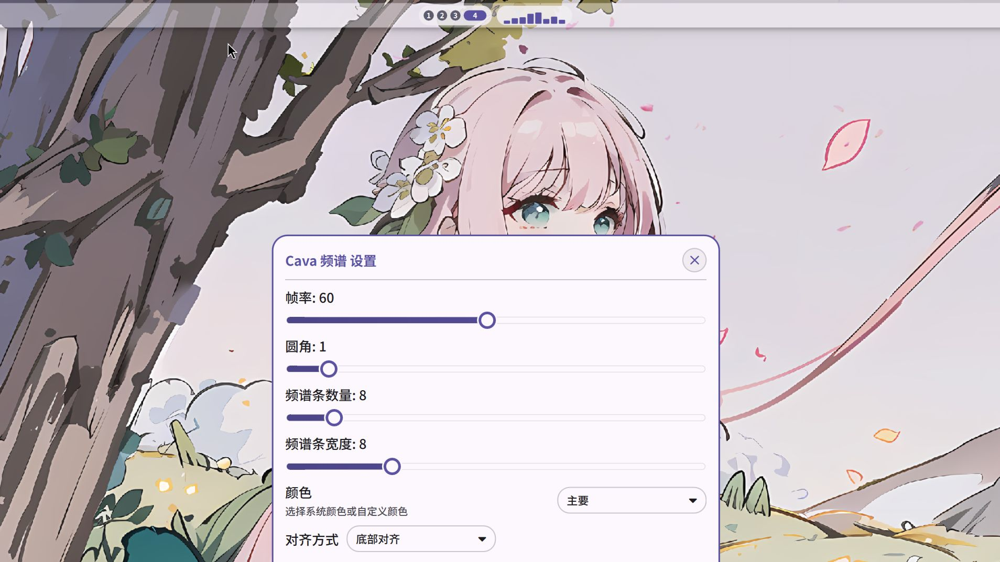

# Cava Visualizer — 基于cava的Noctalia shell音频频谱插件
提供轻量级音频频谱可视化功能，可选择仅在检测到音频播放时显示频谱动画，或在无音频时继续运行 `cava` 并保留其原生空闲状态。  
插件中的cava桥接脚本灵感来源于[SHORiN-KiWATA的waybar音频可视化组件](https://github.com/SHORiN-KiWATA/Shorin-ArchLinux-Guide/blob/72659416bf4b931f5b27296f281b80430779c2ec/dotfiles/.config/waybar/scripts/cava.sh)  
本项目由ai辅助完成    



## 功能
- 调节音频条的帧率、圆角、宽度、音频条数、颜色、对齐方式
- 可配置无音乐时隐藏，或继续运行 `cava` 显示其原生空闲状态

## 依赖
确保已安装cava和音频服务器PulseAudio或者PipeWire

```bash
# Arch Linux / Manjaro
sudo pacman -S cava pipewire-pulse
```  

```bash
# Debian/Ubuntu (需先添加 cava 第三方源)
sudo add-apt-repository ppa:tehtotalpwnage/cava
sudo apt update && sudo apt install cava pipewire-pulse
```

## 安装步骤
### 方式一：通过 Noctalia 插件源直接安装
1. 在 Noctalia 打开「设置 -> 插件 -> Sources」
2. 添加你的插件仓库地址，例如：
   ```text
   https://gitee.com/<your-name>/<repo-name>.git
   ```
3. 回到「Available」页刷新列表并安装 `Cava 频谱`

### 方式二：手动安装
1. 复制插件目录到 Noctalia 插件路径：
   ```bash
   cp -r cava-visualizer/ ~/.config/noctalia/plugins/
   ```

2. 赋予脚本执行权限：
   ```bash
   chmod +x ~/.config/noctalia/plugins/cava-visualizer/cava-bridge.sh
   ```

3. 启用插件：
   - 打开 Noctalia 设置面板
   - 进入「插件」选项卡，启用「Cava Visualizer」
   - 将「cava-visualizer」添加到任务栏组件列表

## 工作原理
插件采用「事件驱动 + 进程隔离」设计，保证低资源占用：

```
Noctalia 任务栏 (BarWidget.qml)
    └── 启动子进程 → cava-bridge.sh
        ├── pactl subscribe ｜ 被动监听音频设备事件（无音频时）
        ├── cava ｜ 音频活跃时启动，输出 ASCII 格式频谱数据
        └── 标准输出 ｜ 向 QML 传递状态：
            - ACTIVE:<频谱数据> ｜ 音频活跃时逐帧输出
            - IDLE ｜ 无音频且未启用保持运行时输出（触发隐藏）
```


## 说明
写这个插件主要是我用qq音乐放歌但是官方的可视化插件无法识别（好像是因为qqmusic的签名是Electron来着）  
要是有谁知道怎么解决的欢迎在issues讨论。

## 常见问题
1. **无频谱显示但音频正常播放**
   - 检查 cava 是否安装成功：`cava -v`
   - 确认音频使用 PulseAudio/PipeWire 输出：`pactl info`
   - 验证脚本权限：`chmod +x cava-bridge.sh`

2. **频谱更新卡顿**
   - 降低 `bars` 数量（建议 ≤16）
   - 调整 `framerate` 为 30（默认值）
   - 检查系统资源占用，关闭高负载进程
